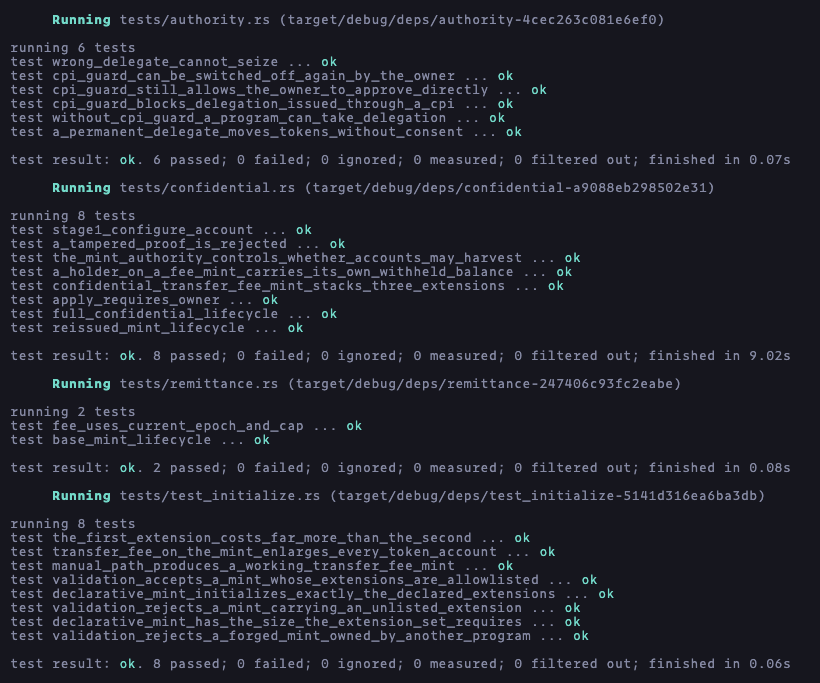

# Solana Token-2022 Remittance Stablecoin

An Anchor program for a fee-bearing remittance token with on-chain metadata, individual KYC thawing, and a confidential version.

## Overview

This project demonstrates two mint lifecycles:

- Create a base mint with transfer fee, metadata, frozen-by-default ATAs, and close authority
- Thaw individual accounts after KYC, transfer with the current fee, collect withheld fees, and close the mint when supply reaches zero
- Reissue the mint with a permanent delegate and manually approved confidential transfers

## Design

| Control                    | Base mint                                                          | Re-issued mint                                          |
| -------------------------- | ------------------------------------------------------------------ | ------------------------------------------------------- |
| Transfer fees              | `TransferFeeConfig`                                                | Same, plus `ConfidentialTransferFeeConfig`              |
| Metadata                   | `MetadataPointer` to the mint and on-mint `TokenMetadata`          | Same                                                    |
| KYC                        | `DefaultAccountState::Frozen`; freeze authority thaws each account | Same                                                    |
| Decommissioning            | `MintCloseAuthority`; zero supply                                  | Same                                                    |
| Seizure of public balances | —                                                                  | `PermanentDelegate`                                     |
| Confidential balances      | —                                                                  | `ConfidentialTransferMint` with manual account approval |

## Instructions

| Instruction                | Purpose                                                                                 |
| -------------------------- | --------------------------------------------------------------------------------------- |
| `create_base_mint`         | Create the mint with on-mint metadata                                                   |
| `create_reissued_mint`     | Create new mint with the base controls, permanent delegate, and confidential extensions |
| `thaw_remittance_account`  | Thaw one account using the mints freeze authority                                       |
| `transfer_with_fee`        | Transfer public tokens with current fee                                                 |
| `deposit_confidential`     | Move public tokens into confidential pending balance                                    |
| `apply_pending_balance`    | Move an owners pending balance into confidential available balance                      |
| `permanent_delegate_seize` | Transfer a public balance using the mints permanent delegate                            |

### Token flows

For public mint, the sender sends the full amount, the receiver receives the amount minus fee, fee is withheld and can be harvested.

For the delegate/confidential mint, the holder deposits public tokens into confidential pending balance, applies them to available balance, and transfers to another approved holder with encrypted fee. The recipient applies the incoming pending balance before withdrawing part of it to the public balance.

## Gap for confidential seizure

The permanent delegate can move a holders public balance without their signature. If a sanctioned holder deposits before the delegate acts, the public seizure path fails and freezing the account does not transfer those funds to the issuer.

See [permanent delegate](https://solana.com/docs/tokens/extensions/permanent-delegate) and [confidential withdrawal](https://solana.com/docs/tokens/extensions/confidential-transfer/withdraw-tokens) documentation for authority and proof flows.

## Setup

Install Rust, Anchor, and Solana.

## Testing

Run all tests:

```bash
anchor test
```



## Submission

### Task status

- [x] Create the base mint with the required extensions and on-mint metadata
- [x] Implement current-epoch public transfers with `transfer_checked_with_fee`
- [x] Read extended account state with `StateWithExtensions` and thaw individual accounts after KYC
- [x] Reissue the mint with permanent delegation and manually approved confidential transfers
- [x] Test the complete confidential lifecycle and document the seizure gap
- [x] Capture a screenshot of the passing tests
